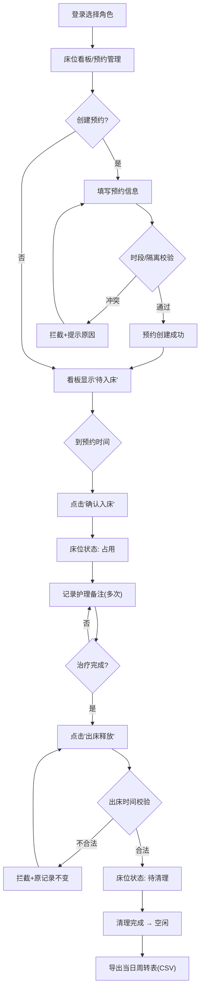

## 1. 产品概述

本地日间病房床位周转管理系统，面向小型诊所/社区医院的护理人员，提供床位可视化看板、预约登记、入出床流程管理、异常记录和数据导出功能。无需对接医院HIS系统，所有数据本地持久化存储，重启后状态完整恢复。

- 核心目标：解决日间病房床位流转效率低、状态不透明、操作无留痕的痛点
- 目标用户：护士长、责任护士、科室管理员
- 产品价值：提升床位周转率30%+，减少人工调度差错，完整记录操作历史便于审计

## 2. 核心功能

### 2.1 用户角色

| 角色 | 注册方式 | 核心权限 |
|------|----------|----------|
| 管理员 | 本地配置创建 | 床位/隔离规则/时段/角色配置、数据导入导出、强制释放床位、查看全部历史 |
| 高级护士 | 本地配置创建 | 新建预约、确认入床、记录护理备注、正常出床释放、查看操作历史 |
| 普通护士 | 本地配置创建 | 新建预约、确认入床、记录护理备注、正常出床释放、不可强制释放占用床位 |

### 2.2 功能模块

1. **床位看板页**：床位状态矩阵、当前占用/下一次安排可视化、快速操作入口、异常告警提示
2. **预约管理页**：预约列表、新建预约表单、预约冲突实时校验、预约状态跟踪
3. **配置中心页**：床位管理、隔离规则配置、可预约时段设置、护士角色管理、样例数据导入
4. **操作历史页**：全量操作日志、异常记录筛选、审批人留痕、状态变更时间线
5. **导出功能**：当日周转表导出（CSV格式）、床位利用率统计

### 2.3 页面详情

| 页面名称 | 模块名称 | 功能描述 |
|----------|----------|----------|
| 床位看板页 | 床位状态矩阵 | 网格布局展示所有床位，颜色区分：空闲(绿)、占用(蓝)、隔离(橙)、待清理(灰)，显示患者姓名和下一次预约时间 |
| 床位看板页 | 床位详情卡片 | 点击床位显示：当前患者信息、入床时间、护理备注列表、历史周转记录 |
| 床位看板页 | 快速操作栏 | 入床确认、添加护理备注、出床释放、异常标记按钮，根据角色权限控制按钮可用性 |
| 预约管理页 | 预约列表 | 按日期+状态筛选，展示预约编号、患者、床位、预约时段、状态标签 |
| 预约管理页 | 新建预约表单 | 患者信息、床位选择(实时显示冲突)、预约时段、隔离类型、备注 |
| 配置中心页 | 床位管理 | 增删改床位编号、所属区域、床位类型(普通/负压/轮椅位) |
| 配置中心页 | 隔离规则配置 | 传染病类型、需要的床位类型、最小隔离时长、跨床禁止规则 |
| 配置中心页 | 时段配置 | 设置可预约时间段（如8:00-12:00、13:00-17:00）、每时段默认时长 |
| 配置中心页 | 护士角色管理 | 护士账号管理、角色分配、密码重置 |
| 配置中心页 | 数据管理 | 导入样例数据、清空数据、数据备份JSON导出/导入 |
| 操作历史页 | 操作日志列表 | 时间倒序展示所有操作：操作类型、操作人、床位/患者、时间、审批人(如有) |
| 操作历史页 | 异常记录 | 异常类型筛选：时间重叠、非法释放、隔离违规、数据冲突，带处理状态 |
| 导出功能 | 当日周转表 | 一键导出CSV：床位号、患者姓名、入床时间、出床时间、总时长、护理次数、异常标记 |

## 3. 核心流程

**主流程（正常周转）**：
管理员/护士在预约管理页创建预约 → 系统自动校验时段冲突和隔离规则 → 预约创建成功 → 到预约时间在床位看板点击"确认入床" → 入床后可多次添加护理备注 → 治疗结束点击"出床释放" → 床位变为"待清理"状态 → 完成清理后变为"空闲" → 导出当日周转表

**非法链路拦截**：
1. 出床时间早于入床时间 → 拦截，提示"出床时间不能早于入床时间"，原入床记录不变
2. 同一床位新预约与已有预约时段重叠 → 拦截，高亮冲突时段，原预约记录不变
3. 普通护士尝试强制释放仍被占用的床位 → 拦截，提示"权限不足，请联系管理员或高级护士"，床位状态不变

## 4. 用户界面设计

### 4.1 设计风格

- **主色调**：医疗蓝 #2563EB 作为品牌主色，搭配浅蓝背景 #EFF6FF
- **辅助色**：成功绿 #10B981（空闲/通过）、警告橙 #F59E0B（隔离/待清理）、危险红 #EF4444（占用异常/拦截）、信息靛 #6366F1（预约）
- **中性色**：Slate色系，深灰标题 #1E293B、中灰正文 #475569、浅灰边框 #E2E8F0
- **按钮样式**：圆润大按钮（rounded-lg），主色按钮带微妙渐变，hover有阴影提升；禁用态灰显
- **字体**：标题使用思源黑体（Noto Sans SC）Bold，正文使用思源黑体 Regular，数字和时间使用等宽字体 JetBrains Mono
- **布局风格**：顶部导航栏 + 左侧快捷菜单 + 主内容区卡片式布局，信息密度适中
- **图标风格**：Lucide线性图标，医疗场景用🏥💊🩺📋做辅助emoji点缀

### 4.2 页面设计概述

| 页面名称 | 模块名称 | UI元素 |
|----------|----------|--------|
| 床位看板页 | 顶部状态栏 | 日期切换器、当前角色标签、统计卡片（总床/空闲/占用/隔离）、导出按钮 |
| 床位看板页 | 床位矩阵网格 | CSS Grid布局，每床卡片140×180px，卡片内：床号大字、状态色块、患者姓名、下一次预约、操作按钮组 |
| 床位看板页 | 床位详情侧栏 | 右侧滑出式抽屉，时间线样式展示入出床记录和护理备注 |
| 预约管理页 | 顶部筛选栏 | 日期范围选择、预约状态筛选(待入床/已入床/已完成/已取消)、搜索框、新建预约按钮 |
| 预约管理页 | 预约卡片列表 | 左对齐时间轴，每条预约含患者头像、信息、床位标签、状态徽章、操作按钮 |
| 配置中心页 | 标签页导航 | 床位/隔离规则/时段/护士角色/数据管理，每个标签独立表单 |
| 配置中心页 | 配置表单 | 左侧预览，右侧编辑，表单项带验证提示，删除操作二次确认弹窗 |
| 操作历史页 | 时间线列表 | 左线右内容，异常记录红色边框+告警图标，审批记录显示审批人签名 |
| 登录弹窗 | 角色选择 | 护士列表卡片式选择，点击后输入密码，含"管理员登录"切换链接 |

### 4.3 响应式

- **Desktop-first**，最小支持宽度 1280px
- 床位矩阵在 1280-1440px 显示4列，1440px+ 显示6列
- 侧栏和弹窗使用固定宽度，移动端降级为底部sheet
- 表格列在小屏可横向滚动，关键列(床号/状态)固定左侧

### 4.4 微交互与动效

- 床位状态变更时卡片有0.3s的缩放+边框色过渡动画
- 侧栏滑出使用translateX + 0.25s cubic-bezier缓动
- 操作成功/失败用顶部Toast提示，成功绿/失败红底色，3s自动消失
- 表单输入focus时边框高亮主色，错误字段抖动+红色边框
- 列表项hover时背景轻微变色，卡片hover上移2px+阴影加深
