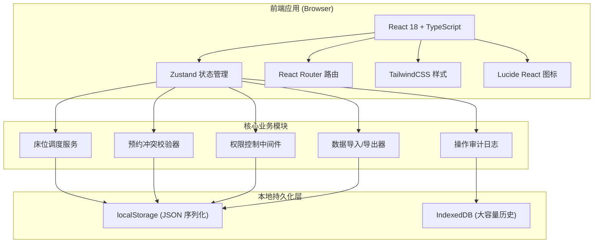

## 1. 架构设计



## 2. 技术描述

- **前端框架**：React@18 + TypeScript@5
- **构建工具**：Vite@5
- **状态管理**：Zustand@4（含 persist 中间件实现 localStorage 持久化）
- **路由**：React Router DOM@6
- **样式**：TailwindCSS@3 + 自定义设计 tokens
- **图标**：lucide-react@0.344
- **后端**：无后端，纯前端架构
- **数据库**：localStorage（配置/预约/当前状态） + IndexedDB（历史日志归档）
- **数据初始化**：内置样例数据 JSON，首次启动一键导入

## 3. 路由定义

| 路由 | 页面组件 | 用途 | 权限 |
|------|----------|------|------|
| /login | Login.tsx | 角色选择登录 | 公开 |
| /dashboard | Dashboard.tsx | 床位看板主页 | 全部角色 |
| /appointments | Appointments.tsx | 预约管理列表 | 全部角色 |
| /appointments/new | NewAppointment.tsx | 新建预约表单 | 全部角色 |
| /config | Config.tsx | 配置中心（标签页） | 仅管理员 |
| /history | History.tsx | 操作历史与异常记录 | 管理员+高级护士 |
| * | NotFound.tsx | 404 页面 | 公开 |

## 4. 状态模型与 Store 定义

```typescript
// 角色类型
type NurseRole = 'admin' | 'senior' | 'normal';

interface Nurse {
  id: string;
  name: string;
  role: NurseRole;
  password: string; // 简单MD5 hash（本地应用场景）
  createdAt: number;
}

// 床位类型
type BedType = 'normal' | 'negative' | 'wheelchair';
type BedStatus = 'idle' | 'occupied' | 'isolated' | 'cleaning';

interface Bed {
  id: string;
  bedNumber: string;
  zone: string;        // 所属区域如 A区/B区
  type: BedType;
  status: BedStatus;
  currentPatientId?: string;
  currentAdmissionId?: string;
  notes?: string;
  createdAt: number;
}

// 隔离规则
interface IsolationRule {
  id: string;
  disease: string;        // 传染病名称
  requiredBedType: BedType; // 需要的床位类型
  minDurationHours: number; // 最小隔离时长
  crossZoneForbidden: boolean; // 是否禁止跨区调床
  createdAt: number;
}

// 可预约时段
interface TimeSlot {
  id: string;
  label: string;       // 如 "上午"
  startTime: string;   // "08:00"
  endTime: string;     // "12:00"
  defaultDurationMin: number; // 默认时长分钟
  active: boolean;
}

// 患者
interface Patient {
  id: string;
  name: string;
  gender: 'male' | 'female';
  age: number;
  phone?: string;
  idCard?: string;
  diagnosis?: string;  // 诊断
  diseaseType?: string; // 关联隔离规则
  createdAt: number;
}

// 预约状态
type AppointmentStatus = 'pending' | 'admitted' | 'completed' | 'cancelled';

interface Appointment {
  id: string;
  patientId: string;
  bedId: string;
  slotId: string;
  appointmentDate: string;  // YYYY-MM-DD
  startTime: number;        // timestamp
  endTime: number;          // timestamp
  isolationRuleId?: string;
  status: AppointmentStatus;
  createdBy: string;        // 护士ID
  createdAt: number;
}

// 入床/出床记录
type AdmissionStatus = 'in_bed' | 'discharged' | 'force_released';

interface Admission {
  id: string;
  appointmentId?: string;
  patientId: string;
  bedId: string;
  admittedAt: number;       // timestamp
  dischargedAt?: number;    // timestamp
  status: AdmissionStatus;
  admittedBy: string;       // 护士ID
  dischargedBy?: string;    // 护士ID
  approvedBy?: string;      // 强制释放审批人
  forceReleased?: boolean;
  dischargeReason?: string;
  createdAt: number;
}

// 护理备注
interface CareNote {
  id: string;
  admissionId: string;
  nurseId: string;
  content: string;
  timestamp: number;
  type: 'observation' | 'medication' | 'treatment' | 'abnormal';
  createdAt: number;
}

// 操作历史
type OperationType = 
  | 'appointment_create'
  | 'appointment_cancel'
  | 'admission_confirm'
  | 'discharge_normal'
  | 'discharge_force'
  | 'care_note_add'
  | 'bed_config_change'
  | 'role_config_change'
  | 'data_import'
  | 'data_export';

interface OperationLog {
  id: string;
  type: OperationType;
  operatorId: string;
  operatorName: string;
  targetType: 'appointment' | 'admission' | 'bed' | 'nurse' | 'system';
  targetId?: string;
  targetName?: string;
  detail: string;       // 操作详情
  timestamp: number;
  approvedBy?: string;  // 审批人
  isAbnormal: boolean;
  abnormalReason?: string;
}

// 异常记录
type AbnormalType = 
  | 'time_overlap'
  | 'discharge_before_admit'
  | 'force_release_denied'
  | 'isolation_violation'
  | 'data_conflict';

interface AbnormalRecord {
  id: string;
  type: AbnormalType;
  operationLogId: string;
  description: string;
  bedId?: string;
  appointmentId?: string;
  handled: boolean;
  handledBy?: string;
  handledAt?: number;
  createdAt: number;
}
```

## 5. Zustand Store 设计

```typescript
interface AppState {
  // 认证
  currentUser: Nurse | null;
  login: (nurseId: string, password: string) => boolean;
  logout: () => void;
  
  // 床位
  beds: Bed[];
  addBed: (bed: Omit<Bed, 'id'|'createdAt'>) => void;
  updateBed: (id: string, patch: Partial<Bed>) => void;
  deleteBed: (id: string) => void;
  
  // 护士
  nurses: Nurse[];
  addNurse: (n: Omit<Nurse, 'id'|'createdAt'>) => void;
  updateNurseRole: (id: string, role: NurseRole) => void;
  
  // 隔离规则
  isolationRules: IsolationRule[];
  addIsolationRule: (r: Omit<IsolationRule, 'id'|'createdAt'>) => void;
  
  // 时段
  timeSlots: TimeSlot[];
  addTimeSlot: (s: Omit<TimeSlot, 'id'>) => void;
  
  // 患者
  patients: Patient[];
  upsertPatient: (p: Omit<Patient, 'id'|'createdAt'>) => Patient;
  
  // 预约
  appointments: Appointment[];
  createAppointment: (payload: CreateAppointmentPayload) => { success: boolean; error?: string; data?: Appointment };
  
  // 入出床
  admissions: Admission[];
  confirmAdmission: (appointmentId: string, nurseId: string) => { success: boolean; error?: string };
  dischargeBed: (admissionId: string, nurseId: string, force?: boolean) => { success: boolean; error?: string };
  
  // 护理备注
  careNotes: CareNote[];
  addCareNote: (note: Omit<CareNote, 'id'|'createdAt'>) => void;
  
  // 操作历史
  operationLogs: OperationLog[];
  abnormalRecords: AbnormalRecord[];
  
  // 工具
  importSampleData: () => void;
  exportDailyReport: (date: string) => string; // CSV content
  resetAllData: () => void;
}
```

## 6. 核心校验规则（非法链路拦截）

```typescript
// 1. 出床时间早于入床时间校验
function validateDischargeTime(admittedAt: number, dischargedAt: number): ValidationResult {
  if (dischargedAt < admittedAt) {
    return { success: false, error: '出床时间不能早于入床时间' };
  }
  return { success: true };
}

// 2. 同一床位时段重叠校验
function validateAppointmentOverlap(
  bedId: string,
  startTs: number,
  endTs: number,
  excludeAppointmentId?: string
): ValidationResult {
  const conflicts = appointments.filter(a => 
    a.bedId === bedId &&
    a.id !== excludeAppointmentId &&
    a.status !== 'cancelled' &&
    startTs < a.endTime && endTs > a.startTime
  );
  if (conflicts.length > 0) {
    return { success: false, error: '该时段与已有预约重叠' };
  }
  return { success: true };
}

// 3. 普通护士强制释放权限校验
function validateForceReleasePermission(role: NurseRole): ValidationResult {
  if (role === 'normal') {
    return { success: false, error: '普通护士无权强制释放占用床位' };
  }
  return { success: true };
}

// 4. 隔离规则校验
function validateIsolationCompliance(
  bedId: string,
  isolationRuleId: string
): ValidationResult {
  const bed = beds.find(b => b.id === bedId);
  const rule = isolationRules.find(r => r.id === isolationRuleId);
  if (bed && rule && bed.type !== rule.requiredBedType) {
    return { success: false, error: `该传染病需使用${rule.requiredBedType}类型床位` };
  }
  return { success: true };
}
```

所有校验失败时：
- 不写入任何状态变更（原子操作：先校验全部通过再写入）
- 记录一条带 `isAbnormal: true` 的操作日志
- 创建对应的异常记录
- Toast 提示具体错误原因

## 7. 持久化策略

使用 zustand persist 中间件：
- **Store 白名单持久化**：`beds, nurses, isolationRules, timeSlots, patients, appointments, admissions, careNotes, operationLogs, abnormalRecords` 全部持久化到 localStorage，key=`dayward-board:v1`
- **首次启动检测**：localStorage 无数据时显示"导入样例数据"引导
- **导出格式**：
  - 周转表：CSV（UTF-8 BOM 兼容 Excel）
  - 完整备份：JSON（可通过配置中心导入恢复）
- **导入安全**：导入前先完整校验 JSON schema，校验失败拒绝导入
